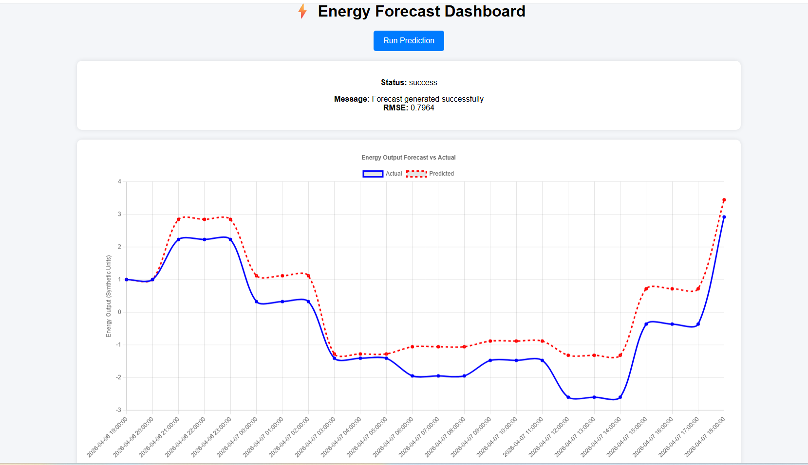
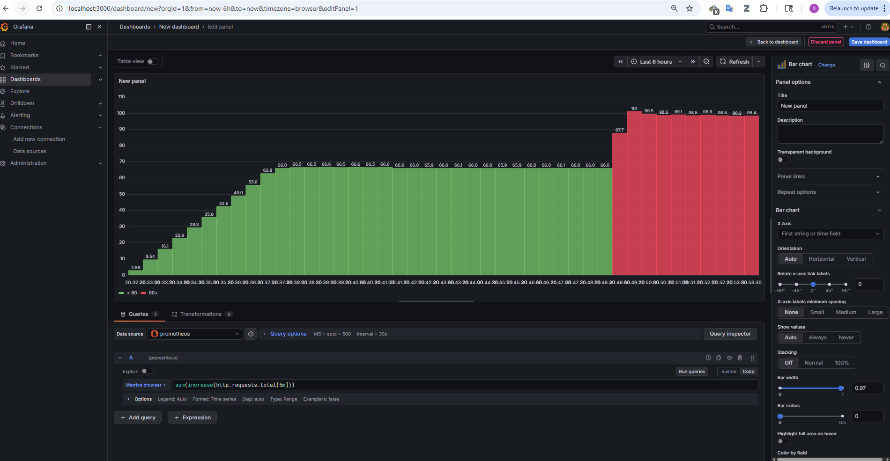

# energy-forecasting-ml-system
# ⚡ Energy Forecasting ML System (Production-Ready)

## 🚀 Overview
This project implements a production-style end-to-end machine learning system for energy forecasting using real-time weather data.

The system ingests external API data, performs feature engineering, trains a time-series model, and serves predictions through a 
scalable API. It also includes monitoring, visualization, and orchestration components, mimicking real-world ML infrastructure.

## 🧰 Tech Stack

## 🧰 Tech Stack

[](https://www.python.org/downloads/release/python-3100/)
[](https://spark.apache.org/docs/latest/api/python/)
[](https://scikit-learn.org/stable/)
[](https://mlflow.org/)
[](https://fastapi.tiangolo.com/)
[](https://www.docker.com/)
[](https://github.com/features/actions)
[](https://ubuntu.com/)
[](https://www.postgresql.org/)
[](https://prometheus.io/)
[](https://grafana.com/)
[](https://aws.amazon.com/ec2/)

## 💻 Product Development API App (Real-Time)

This project provides **real-time energy forecasting** using live data from external APIs.  
The system automatically extracts current data, processes it, and generates predictions through a production-ready ML pipeline.

### 📊 Forecast Output (API + Dashboard)




### 🔍 Example Output Interpretation

- Forecast successfully generated  
- Model performance (RMSE) displayed  
- Real-time comparison between **actual vs predicted energy output**

---

### ⚠️ Disclaimer

This application is intended for:

- Research exploration  
- ML pipeline demonstration  
- Educational and portfolio purposes  

🚫 Not intended for real-world operational decision-making


## 🧠 Key Features
🌐 Real-time data ingestion (OpenWeather API)
🧹 Automated data cleaning & feature engineering
📈 Time-series forecasting using SARIMAX
💾 Model persistence (model.pkl)
⚡ FastAPI-based inference API
🐳 Fully Dockerized multi-service architecture
📊 Monitoring with Prometheus
📉 Visualization with Grafana
⏱️ Workflow orchestration with Airflow
🗄️ PostgreSQL integration for storage

---
## 🏗️ System Architecture
````
User → FastAPI (/predict)
        ↓
   ML Model (SARIMAX)
        ↓
 PostgreSQL (store results)

+ Prometheus (metrics collection)
+ Grafana (monitoring dashboard)
+ Airflow (pipeline orchestration)
+ Docker (containerization)
````


## 🏗️ Project Structure
````
energy_forecasting/
│
├── api.py                 # FastAPI app (inference API)
├── model.py               # Model training & prediction logic
├── clean_data.py          # Data cleaning & feature engineering
├── ingest_data.py         # API data ingestion
├── main_pipeline.py       # End-to-end pipeline orchestration
│
├── db_connection.py       # PostgreSQL connection
├── db_save.py             # Save predictions to DB
│
├── docker-compose.yml     # Multi-service orchestration
├── Dockerfile             # App container
├── prometheus.yml         # Prometheus config
│
├── templates/
│   └── index.html         # Dashboard UI
│
├── dags/
│   └── ml_pipeline.py     # Airflow DAG
│
├── docs/
│   └── grafana_dashboard.png  # Monitoring screenshot
│
├── model.pkl              # Trained model (generated)
├── requirements.txt
├── README.md
└── .env (NOT included)

````

## 📊 Monitoring Dashboard
Real-time monitoring of API requests and system performance using Prometheus and Grafana:

### 📈 Monitoring & System Metrics (Grafana)




## 🚀 How to Run

```bash
git clone <repo>
cd energy_forecasting

docker-compose up --build

API → http://localhost:8000/predict
Grafana → http://localhost:3000
Airflow → http://localhost:8080